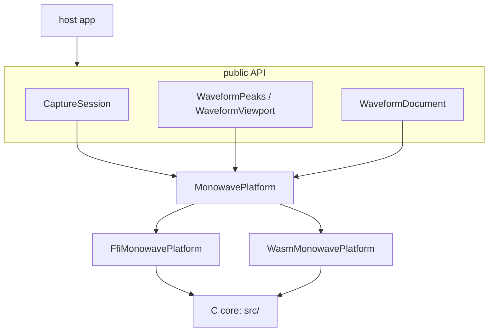

# Architecture

Monowave is a headless Flutter package for microphone capture, waveform peaks, and non-destructive audio editing.
Headless is the organizing constraint, not a detail, and it is inherited deliberately from monolens: the package exports no widget, and every boundary it draws follows from that.

A capture hands back reduced frames.
A decode hands back a zero-copy view over min/max peaks plus the viewport maths to place them.
What the listener sees is the host's to build.

This page is the shape and the reasoning.
The task-level API is in the [recipes](../10-recipes/00-decode-a-file.md); this is why it looks the way it does.

## Why headless

An audio package that ships widgets asks every consumer to accept its design language, or to fight it.
It also asks them to accept its idea of what a waveform is, which is worse -- a voice note, a podcast scrubber and a trim editor want three different pictures out of the same data.

The rule this leaves is checkable, and CI checks it.
Nothing under `lib/` imports Flutter's widget, Material or Cupertino libraries.
A grep returning nothing is the invariant.

The grep matches `import` and `export` directives specifically, not the bare path.
A looser search also hits the doc comment that *states* the rule, which fails the build for describing it.

The cost lands in exactly one place: the host writes the `CustomPainter`.
Monowave's job is to make that a few lines rather than a research project, which is what `WaveformViewport` and the zero-copy peak views are for.

## Layers



Dependency direction is one-way: host to API to seam to binding to C core.
The two bindings are alternatives, never both in one build, and both reach the same C.

| Directory | Role |
|---|---|
| `src/` | The C core. Decode, peak reduction, capture and export. The only place audio is actually processed. |
| `src/vendor/` | miniaudio, dr_wav, dr_mp3, dr_flac. Vendored, never edited. |
| `hook/build.dart` | Compiles `src/` into a code asset for the five native targets. |
| `tool/build_wasm.sh` | Compiles the same `src/` to WASM for web, into `assets/`. |
| `lib/src/platform/` | `MonowavePlatform`, the mockable seam, and its two implementations. |
| `lib/src/native/` | ffigen output. Never edited by hand. |
| `lib/src/model/` | Peaks, viewport, timeline, selection. Pure Dart, pure maths. |
| `lib/src/capture/` | The session, the rolling scope, and the drain loop. |
| `lib/src/edit/` | Documents, edits as values, and undo. |
| `lib/src/codec/` | BBC `.dat` and the compact bar summary. |
| `lib/testing.dart` | Fakes. Deliberately not exported from `monowave.dart`. |

## Why FFI, and not pigeon

Monolens routes all platform traffic through [Pigeon](https://pub.dev/packages/pigeon), and argues for it well: the payloads are structured, three languages have to agree, and a schema change should break the build rather than a device.
Monowave breaks with that, and the divergence is a decision rather than an oversight.

**Pigeon cannot carry the realtime path.**
A capture callback fires roughly 86 times a second on the audio thread, where it must not allocate, take a lock, or call into a message channel.
The transport has to be a lock-free ring buffer in shared memory.
That is not a payload-shape problem, which is what pigeon solves.

**Maximizing platform coverage inverts the cost.**
Pigeon means one native implementation per platform.
For camera work across two platforms that is correct.
For audio across six it is six decoders that will drift, and drift in a waveform is visible: the same file renders differently on Android and web.
One C core compiled via FFI on the five native targets and to WASM for web is one implementation, and it lets CI *assert* that peaks come out byte-identical everywhere.

**What is kept unchanged is the seam.**
`MonowavePlatform` is an interface in front of the bindings rather than direct calls into them, exactly as `MonolensPlatform` sits in front of the generated pigeon API.
That indirection buys the same two things.
The whole engine -- peaks, mipmaps, viewport, selection, undo -- is testable against a fake with no native code and no device.
And it is the line a federated split would cut along, if per-platform versioning is ever needed.
The package is not federated today because one package is simpler and nothing needs it yet.

## How the native side is built

`hook/build.dart` is a Dart build hook: `package:hooks` drives it, `package:native_toolchain_c` compiles `src/`, and the result is a `CodeAsset` the Dart VM resolves at the `@DefaultAsset` id.

This replaces the per-platform CMake, podspec and Gradle scaffolding a classic FFI plugin template would carry, and it is why `pubspec.yaml` has no `flutter: plugin:` block at all.
There are no plugin classes to register, because nothing crosses a method channel.

Consumers must opt in:

```bash
flutter config --enable-native-assets
```

That flag is the main cost of this approach, and it is why the mechanism was tested on every reachable target before anything was built on it.

Two constraints fell out of that spike and are load-bearing:

- **Tests are `package:test`, not `flutter_test`.**
  A headless package has no widget tree to bind, so this is the right shape anyway -- but it is also forced.
  `flutter_test` pins `meta 1.18.0` from the SDK, which the hook packages cannot satisfy.
  The upside is that the engine suite runs under `dart test` in seconds.
- **The hook packages are held one patch below latest.**
  `hooks 2.1.0` and `native_toolchain_c 0.19.3` moved to `meta ^1.19.0`; Flutter stable pins `meta 1.18.0`, so those versions cannot resolve alongside `flutter` at all.
  The upper bounds are explicit rather than left to backtracking, which takes minutes against a graph this size.

### The bug worth knowing about

Through five milestones the library was correctly bundled in every Android APK and failed to `dlopen` on every one of them: `cannot locate symbol "pow"`.
Apple's libSystem provides the math functions implicitly; Android and Linux do not, so the build hook was missing `libraries: ['m']`.

CI was green throughout, because it asserted the `.so` was *inside* the APK -- which is not the same as it loading.
Running it on a real device is what found it.
If you are building something similar, that is the check to write.

## The web path

`dart:ffi` does not exist on web, so web gets the second binding: the same `src/` compiled to WASM by `tool/build_wasm.sh`, reached over `dart:js_interop`.

**The WASM artifact is committed, and shipped as a Flutter asset.**
Committing it avoids requiring emscripten in every consumer's build, which would make a `flutter build web` of any app depending on monowave fail unless that app's CI installed a C toolchain.
CI compensates by rebuilding the artifact from source and asserting it matches what is committed, so the binary can never silently drift from `src/`.

`WasmMonowavePlatform` never answers from a pure-Dart shim; if the module is missing it throws.
A shim would pass CI and hide the fact that web is not running the same code as the other five targets, which is the single property this architecture exists to guarantee.

Three details of the WASM contract are load-bearing and easy to get wrong:

- `-sALLOW_MEMORY_GROWTH` makes the module **import** `env.emscripten_notify_memory_growth`.
  Instantiating with an empty import object throws.
  Monowave supplies a no-op, because it re-reads the heap on every call rather than caching views.
- `-sSTANDALONE_WASM` builds the reactor model, so `_initialize()` must be called after instantiation or static initializers never run.
- The exports are reached through extension types rather than `dart:js_interop_unsafe`, so a rename in `src/` is a compile error rather than a runtime `undefined is not a function`.

### Why web forced an initialization step into the API

`ensureInitialized()` exists entirely because of web.
Native targets resolve their code asset at startup and have nothing to wait for, but instantiating a WASM module is inherently asynchronous.
The alternative -- making every method return a `Future` -- would put an event-loop turn in front of `reduceMinMax`, which is called once per frame while scrubbing and once per hop while capturing.
One await up front is the cheaper shape, and it is a no-op on five of the six targets.

### Web capture will not go through miniaudio

miniaudio does have a Web Audio backend, and by default it uses a `ScriptProcessorNode` rather than an AudioWorklet, so `SharedArrayBuffer` is not required after all.
AudioWorklets are opt-in behind `MA_ENABLE_AUDIO_WORKLETS`, and *those* need `-sAUDIO_WORKLET=1 -sWASM_WORKERS=1 -sASYNCIFY`, which is where the shared-memory requirement actually lives.

But the blocking problem is a different one.
Either way, miniaudio's web backend needs emscripten's JavaScript runtime, and monowave's artifact is deliberately `-sSTANDALONE_WASM --no-entry` with no JS glue at all.
Adopting it would mean a second, differently-built WASM module, `ASYNCIFY` overhead, and a larger artifact -- one that ships on all six targets even though only web reads it.

**Decision: web capture will be a small AudioWorklet written directly against the browser's own APIs.**
The browser already provides `getUserMedia` and `AudioWorklet`; miniaudio's value on native is that it abstracts five different backends, and on web there is only one.
The reduction it would be doing is a min and a max over int16 values -- perhaps fifteen lines of JavaScript.

This is the one place monowave would not run the same C on every target, so it is worth being precise about the cost.
For decoding, identical peaks matter enormously: a stored waveform has to look the same on every client.
For capture, the reduction is `min` and `max` over integers, which is exact in both languages by construction rather than by luck -- there is no floating point in the path where a last bit could differ.

**Status: not implemented.**
Decode and rendering work on web today; capture does not, and `openCapture` throws rather than pretending otherwise.

## Where drawing stops being monowave's problem

Shipping no widget only pays off if the boundary is drawn somewhere sensible, so it is worth stating: the design system owns presentation, monowave owns data, and the host implements the controller between them.

monokit is the design system on the other side of that line, and it is shaped to match.
`MonoWaveform` and `MonoVoiceNote` are components; `MonoPlaybackController` is an interface rather than an implementation, because monowave never sees a player and neither should they.
`CompactBars.heights()` feeds `MonoWaveform` directly, so a fixed-bar voice note needs no painter from anyone.

What a component of that shape cannot do is min/max asymmetry and a viewport that zooms, because both need more than one number per bar.
That is what `PeakWindow` and `WaveformViewport` are for, and the example carries a reference painter over them -- see [drawing a waveform](../10-recipes/10-draw-a-waveform.md).

## Editing is non-destructive, and undo is a snapshot

A document is a list of regions: a range in the source, a gain, two fade lengths.
Nothing in the edit layer decodes, copies or mutates audio.
The source is read exactly once, at export.

That buys two things that would otherwise be awkward.
`previewPeaks` derives the edited waveform by concatenating slices of the source's finest level and scaling by gain, so the display updates the instant an edit lands rather than after a decode.
And undo stores whole documents rather than inverse operations, which is the same call monolens's `EditHistory` makes and for the same reason: undo is cheap precisely because an edit is a value, there is nothing to invert, and some edits have no inverse at all -- a fade destroys the samples it fades.

Export writes 16-bit PCM WAV and only WAV.
An edit list is meant to reproduce the source exactly where it did not change it, and re-encoding through a lossy codec would quietly break that.
Fades are linear rather than equal-power, because they exist to take the click off an edit point rather than to crossfade two takes, and linear is what makes the endpoints exactly 0 and 1.

## What a pyramid is

Level 0 is the finest resolution held.
Each level above it covers twice as many samples per min/max pair:

| | Samples per pair | Pairs (3-hour file) |
|---|---|---|
| Level 0 | 128 | 3,720,937 |
| Level 1 | 256 | 1,860,468 |
| Level 2 | 512 | 930,234 |
| ... | ... | ... |
| Level 22 | 536,870,912 | 1 |

Zooming picks a level rather than re-reading data, which is what makes a pan over a three-hour recording cost the same as a pan over thirty seconds.

**The reduction is min/max, never an average.**
Averaging collapses transients and renders speech as a flat sausage.
Every level above the base combines its children by taking the min of the mins and the max of the maxes, so the extremes of the moment survive all the way up.
RMS combines as the root of the mean of the squares, so a coarse level stays an RMS rather than becoming an average of averages.

## Why the pyramid is worth its memory

The pyramid doubles the memory of the base level, and what it buys is that preparing a frame costs the same whether the recording is thirty seconds or three hours.

Measured on a three-hour pyramid -- 476 million samples, 3.7 million pairs at the 128-sample base, 23 levels -- a full zoom sweep resolves the viewport and reads every visible pair in **5.6 microseconds per frame**. A 60fps budget is 16,667 microseconds.
The test asserts a ceiling rather than the exact figure, because the number varies by machine and the property being protected is that it stays bounded by screen pixels rather than by file length.

If that test ever fails, zooming a long file has started scanning data instead of picking a level, and the pyramid has stopped earning its keep.

### Snapping is bucket-accurate, not sample-accurate

`WaveformSnap` works from peaks, so it resolves to the finest level -- about 3 ms at a 128-sample base and 44.1 kHz.
That is inaudible for a trim point, and it is stated plainly because "snap to zero crossing" normally implies exactness.
Sample-exact snapping would mean re-reading the source audio on every gesture, which is a decode per drag.

## Peaks memory model

Peaks are allocated by C and Dart holds a typed-data view over that memory.
Nothing is copied, so a three-hour file never touches the Dart heap and never pressures the GC.

There is one hazard specific to web, and it is why the two bindings differ.
Growing the WASM heap detaches every outstanding view over it, so a long-lived view stays correct only until the next allocation anywhere in the module.
Rather than try to police that, the web binding **copies** the pyramid out of the heap and frees the native allocation immediately; the native binding keeps the zero-copy view.
Web pays a few hundred kilobytes for a normal recording, and native keeps the property an audiobook needs.

### Two rings, not one

Capture keeps the reduction and the audio in separate lock-free rings.

They have completely different rates -- 86 frames a second against 44,100 samples -- and completely different consequences when they overflow.
A dropped visualizer frame is cosmetic; a dropped audio sample is a hole in the recording.
Sharing one ring would let a slow file write starve the visualizer, or a paused visualizer stall the writer.

Neither ring ever blocks the producer.
The audio thread copies into both and moves on; `CaptureSession` drains them on its timer and writes the WAV, because file I/O on an audio callback is precisely the unbounded operation the whole design exists to avoid.

### The determinism check

This is the assertion the whole design answers to, and it runs two ways.

`dart test` decodes six synthesized fixtures and hashes each pyramid, on ubuntu, macOS and Windows.
`tool/verify_wasm.mjs` decodes the same fixtures through the WASM module and asserts the same digests.
Between them, one C source reached over two entirely different bindings on four host platforms has to agree exactly.

The hash is FNV-1a, and three details of it were bugs first.
It covers *both* series at every level -- the interleaved min/max pairs and the RMS beside them.
Hashing only the peaks is how 0.3.0 shipped a web build whose `rms` was null on every level while this check stayed green on all six targets, so a digest that covers less than the pyramid is a determinism check with a hole in it.
It hashes int16 *values* in explicit little-endian order rather than a byte view, so it does not depend on host endianness.
And it is 32-bit with a shift-decomposed multiply rather than 64-bit, because Dart integers are 64-bit on the VM but doubles on web -- a 64-bit FNV silently produces different numbers under `dart2js`, which would have made the check meaningless on the one target it exists to police.

A digest only sees what a binding asks for, which is why `tool/verify_wasm.mjs` also checks the surface itself.
Every function the `_Core` extension type declares has to be present in `assets/monowave.wasm`, named in `-sEXPORTED_FUNCTIONS`, and actually called by the binding.
That is the check that would have caught `wf_peaks_rms` missing from the build's export list, which no amount of hashing could.
