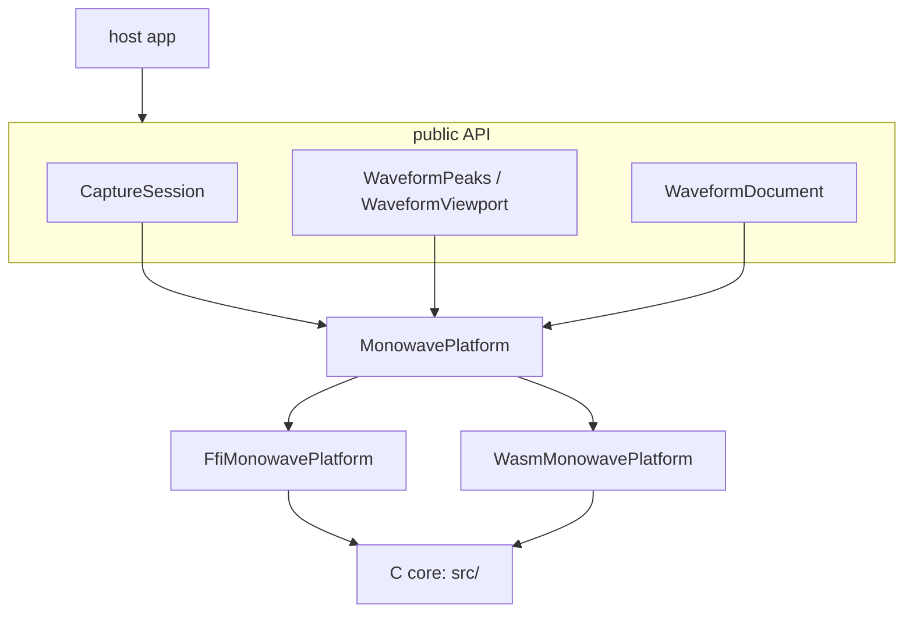

# Architecture

monowave is a headless Flutter package for microphone capture, waveform peaks, and non-destructive audio editing.
Headless is the constraint that organizes the design, not a detail.
monowave inherits this constraint from monolens deliberately: the package exports no widget, and every boundary that the package draws is a result of that constraint.

A capture returns reduced frames.
A decode returns a zero-copy view over min/max peaks, and the viewport math that puts those peaks in position.
The host builds what the user sees.

This page gives the shape of the package and the reasons for it.
The task-level API is in the [recipes](../10-recipes/00-decode-a-file.md).
This page explains why that API looks the way it does.

## Why headless

An audio package that ships widgets asks every host to accept its design language, or to fight it.
That package also asks every host to accept its idea of what a waveform is.
This second demand is worse.
A voice note, a podcast scrubber and a trim editor want three different pictures out of the same data.

This constraint leaves one rule, and a machine can apply it.
CI asserts that the code obeys the rule.
Nothing under `lib/` imports the widget, Material or Cupertino libraries of Flutter.
The invariant is that a grep returns nothing.

The grep matches the `import` and `export` directives specifically, and not the bare path.
A looser search also hits the doc comment that *states* the rule.
Then the build fails because the comment describes the rule.

The cost is in exactly one place: the host writes the `CustomPainter`.
The job of monowave is to keep that work to a few lines rather than a research project.
`WaveformViewport` and the zero-copy peak views exist for this purpose.

## Layers



Dependency direction is one-way: host to API to seam to binding to C core.
The two bindings are alternatives, and one build contains one binding and never both.
Both bindings reach the same C core.

| Directory | Role |
|---|---|
| `src/` | The C core. Decode, peak reduction, capture and export. The only place that processes audio. |
| `src/vendor/` | miniaudio, dr_wav, dr_mp3, dr_flac. This code is vendored, and nobody edits it. |
| `hook/build.dart` | Compiles `src/` into a code asset for the five native targets. |
| `tool/build_wasm.sh` | Compiles the same `src/` to WASM for web, into `assets/`. |
| `lib/src/platform/` | `MonowavePlatform`, the mockable seam, and its two implementations. |
| `lib/src/native/` | ffigen output. Nobody edits it by hand. |
| `lib/src/model/` | Peaks, viewport, timeline, selection. Pure Dart, pure math. |
| `lib/src/capture/` | The session, the rolling scope, and the drain loop. |
| `lib/src/edit/` | Documents, edits as values, and undo. |
| `lib/src/codec/` | BBC `.dat` and the compact bar summary. |
| `lib/testing.dart` | Fakes. `monowave.dart` does not export them, deliberately. |

## Why FFI, and not Pigeon

Monolens routes all platform traffic through [Pigeon](https://pub.dev/packages/pigeon), and argues for it well.
The payloads are structured.
Three languages have to agree.
A schema change breaks the build rather than a device.
monowave does not use Pigeon, and the difference is a decision rather than an oversight.

**Pigeon cannot carry the realtime path.**
A capture callback fires approximately 86 times each second on the audio thread.
On that thread, the callback must not allocate memory, take a lock, or call into a message channel.
The transport has to be a lock-free ring buffer in shared memory.
That is not a problem of payload shape.
Pigeon solves problems of payload shape.

**A goal of maximum platform coverage inverts the cost.**
Pigeon means one native implementation per platform.
For camera work across two platforms, that approach is correct.
For audio across six platforms, that approach gives six decoders that will drift.
Drift in a waveform is visible: the same file looks different on Android and web.
monowave compiles one C core through FFI for the five native targets, and to WASM for web.
The result is one implementation, and CI can therefore *assert* that peaks are byte-identical everywhere.

**monowave keeps the seam unchanged.**
`MonowavePlatform` is an interface in front of the bindings, and not direct calls into the bindings.
`MonolensPlatform` sits in front of the generated Pigeon API in exactly the same way.
This indirection does the same two things.
First, a test can run the whole engine -- peaks, mipmaps, viewport, selection, undo -- against a fake, with no native code and no device.
Second, if per-platform versioning is ever necessary, a federated split cuts along the seam.

The package is not federated today because one package is simpler, and nothing needs a federated split yet.

## How the native side is built

`hook/build.dart` is a Dart build hook.
`package:hooks` drives the hook, and `package:native_toolchain_c` compiles `src/`.
The result is a `CodeAsset` that the Dart VM resolves at the `@DefaultAsset` id.

A classic FFI plugin template carries per-platform CMake, podspec and Gradle scaffolding.
This build hook replaces all of that scaffolding.
For this reason, `pubspec.yaml` has no `flutter: plugin:` block at all.
There are no plugin classes to register, because nothing crosses a method channel.

Every host must enable native assets:

```bash
flutter config --enable-native-assets
```

That flag is the main cost of this approach.
For this reason, a spike ran the mechanism on every reachable target before any other work depended on the mechanism.

That spike produced two constraints, and both are load-bearing:

- **Tests are `package:test`, not `flutter_test`.**
  A headless package has no widget tree to bind, so this is the correct shape anyway.
  This shape is also forced.
  `flutter_test` pins `meta 1.18.0` from the SDK, and the hook packages cannot satisfy that pin.
  As a result, the engine suite runs under `dart test` in seconds.
- **monowave pins the hook packages to the patch version before the latest.**
  `hooks 2.1.0` and `native_toolchain_c 0.19.3` moved to `meta ^1.19.0`.
  Flutter stable pins `meta 1.18.0`, so those versions cannot resolve alongside `flutter` at all.
  The upper bounds are explicit.
  The alternative is to let the resolver backtrack, and backtracking takes minutes against a graph of this size.

### The bug that only a device found

Through five milestones, the build put the library correctly into every Android APK.
On every one of those APKs, `dlopen` failed with `cannot locate symbol "pow"`.
The Apple libSystem library provides the math functions implicitly.
Android and Linux do not provide them.
The cause was a build hook without `libraries: ['m']`.

CI stayed green through all of it, because CI asserted that the `.so` file was *inside* the APK.
A file inside the APK is not the same as a file that loads.
A run on a real device found the bug.
If you build something similar, that check is the one to write.

## The web path

`dart:ffi` does not exist on web, so web uses the second binding.
That binding is the same `src/` compiled to WASM by `tool/build_wasm.sh`, and Dart reaches it over `dart:js_interop`.

**monowave commits the WASM artifact, and ships it as a Flutter asset.**
A committed artifact removes the need for emscripten in the build of every host.
Without this artifact, any application that depends on monowave must install a C toolchain in its CI, or `flutter build web` fails.
CI rebuilds the artifact from source and asserts that the result matches the committed file.
As a result, the binary can never drift from `src/` without notice.

`WasmMonowavePlatform` never answers from a pure-Dart shim.
If the module is absent, `WasmMonowavePlatform` throws.
If monowave answers from a shim, that shim passes CI.
The shim also hides one fact: web does not run the same code as the other five targets.
The same code on every target is the single property that this architecture exists to guarantee.

Three details of the WASM contract are load-bearing, and an error in any one of them is easy to make:

- `-sALLOW_MEMORY_GROWTH` makes the module **import** `env.emscripten_notify_memory_growth`.
  An instantiation with an empty import object throws.
  monowave supplies a no-op, because monowave re-reads the heap on every call and does not cache the views.
- `-sSTANDALONE_WASM` builds the reactor model.
  The binding must call `_initialize()` after instantiation, or the static initializers never run.
- The binding reaches the exports through extension types, and not through `dart:js_interop_unsafe`.
  As a result, a rename in `src/` is a compile error and not a runtime `undefined is not a function`.

### Why web forced an initialization step into the API

`ensureInitialized()` exists entirely because of web.
Native targets resolve their code asset at startup, and have nothing to wait for.
An instantiation of a WASM module is asynchronous by nature.

The alternative is a `Future` return from every method.
That alternative puts an event-loop turn in front of `reduceMinMax`.
A scrub calls `reduceMinMax` one time for each frame, and a capture calls it one time for each hop.
One await at the start is the cheaper shape, and it is a no-op on five of the six targets.

### Web capture will not use miniaudio

miniaudio does have a Web Audio backend.
By default, that backend uses a `ScriptProcessorNode` rather than an AudioWorklet, so `SharedArrayBuffer` is not necessary after all.
AudioWorklets are off by default, behind `MA_ENABLE_AUDIO_WORKLETS`.
AudioWorklets need `-sAUDIO_WORKLET=1 -sWASM_WORKERS=1 -sASYNCIFY`, and the requirement for shared memory comes from those three flags.

The problem that blocks this approach is a different one.
In both cases, the web backend of miniaudio needs the JavaScript runtime of emscripten.
The artifact of monowave is deliberately `-sSTANDALONE_WASM --no-entry`, with no JS glue at all.

Adoption of miniaudio on web brings three costs.
The first is a second WASM module with a different build.
The second is `ASYNCIFY` overhead.
The third is a larger artifact, and that artifact ships on all six targets although only web reads it.

**Decision: web capture will be a small AudioWorklet, written directly against the APIs of the browser.**
The browser already provides `getUserMedia` and `AudioWorklet`.
On native targets, the value of miniaudio is that it abstracts five different backends.
On web there is only one backend.
The reduction in that worklet is a min and a max over int16 values.
That work is approximately fifteen lines of JavaScript.

Web capture is the one place where monowave will not run the same C on every target, so the cost needs a precise statement.
For decode, identical peaks matter very much: a stored waveform has to look the same on every client.
For capture, the reduction is `min` and `max` over integers.
This reduction is exact in both languages by construction rather than by luck.
There is no floating point in the path where a last bit can differ.

**Status: not implemented.**
Decode and drawing work on web today.
Capture does not work on web, and `openCapture` throws an error rather than a false success.

## The boundary between monowave and the drawing work

If the boundary is not in a sensible place, a package with no widget gives no benefit.
This page therefore states the boundary.
The design system owns what the user sees.
monowave owns the data.
The host implements the controller between them.

monokit is the design system on the other side of that line, and its shape matches this boundary.
`MonoWaveform` and `MonoVoiceNote` are components.
`MonoPlaybackController` is an interface rather than an implementation, because monowave never sees a player, and monokit must not see one either.
`CompactBars.heights()` feeds `MonoWaveform` directly, so a fixed-bar voice note needs no painter from anyone.

A component of that shape cannot do min/max asymmetry or a viewport that zooms.
Both of these need more than one number per bar.
`PeakWindow` and `WaveformViewport` exist for these two cases.
The example carries a reference painter over them.
The recipe [drawing a waveform](../10-recipes/10-draw-a-waveform.md) shows that painter.

## Playback belongs here, and nearly did not

monowave can capture, draw, edit and export a document.
monowave cannot play a document, and this gap is real.
The only way to hear an edit today is `exportWav`.
As a result, a user hears a trim after the commit, and not during a drag of the handle.

The first design put that work in a separate package.
That design read the rule "monowave never sees a player" as a prohibition.
The rule is not a prohibition.
The rule is about *coupling*.
`WaveformTimeline` takes a sample rate and a length rather than a player instance, so monowave never depends on `just_audio` or `media_kit`.
If monowave implements its own playback, monowave takes a dependency on nobody.

Three facts settled this question.

A separate package duplicates **123,179 lines of vendored C**.
miniaudio alone is 95,864 of those lines, and this package already compiles miniaudio for capture.
A separate package also duplicates four platform fixes in the build hook.
One of those fixes is the `-lm` lesson in the earlier section.

The correctness property is weaker outside this package.
A renderer here shares `wf_source_*` and `wf_envelope` with `wf_export_wav`, so "the preview sounds like the export" is structural.
In a sibling package, that property becomes a port that a test has to police.
A sibling package also needs a decoder version pin across two repositories.
When that pin becomes stale, nothing notices.

monowave already opens an audio device.
`ma_device_init` runs in `wf_capture.c` today.
A package that opens a microphone and not a speaker is the odd shape.

**One boundary survives the move.**
`MonoPlaybackController` lives in monokit, and monowave must not depend on the design system.
Such a dependency inverts the layering that an earlier section of this page defends.
Therefore monowave will own the engine and will implement no monokit interface.
The adapter stays the few lines that a host writes, and `DemoPlayer` is exactly that adapter today.

The design and the milestones are in [ROADMAP.md](../../ROADMAP.md).

## Edits are non-destructive, and undo is a snapshot

A document is a list of regions: a range in the source, a gain, two fade lengths.
Nothing in the edit layer decodes, copies or changes audio.
The package reads the source exactly one time, at export.

This design gives two things that are otherwise awkward.
First, `previewPeaks` derives the edited waveform: it joins slices of the finest level of the source, and scales them by gain.
Therefore the waveform on screen updates the moment that an edit lands, and not after a decode.

Second, undo stores whole documents rather than inverse operations.
`EditHistory` in monolens makes the same call, and for the same reason.
Undo is cheap precisely because an edit is a value.
There is nothing to invert.
Some edits have no inverse at all.
For example, a fade erases the samples that it fades.

Export writes 16-bit PCM WAV and only WAV.
An edit list reproduces the source exactly where the list did not change the source.
A re-encode through a lossy codec breaks that property without notice.
Fades are linear rather than equal-power.
A fade exists to remove the click at an edit point, and not to crossfade two takes.
A linear fade makes the endpoints exactly 0 and 1.

## What a pyramid is

Level 0 is the finest resolution that the pyramid holds.
Each level after level 0 covers two times as many samples for each min/max pair:

| | Samples per pair | Pairs (3-hour file) |
|---|---|---|
| Level 0 | 128 | 3,720,937 |
| Level 1 | 256 | 1,860,468 |
| Level 2 | 512 | 930,234 |
| ... | ... | ... |
| Level 22 | 536,870,912 | 1 |

A zoom picks a level, and does not read the data again.
Therefore a pan over a three-hour recording costs the same as a pan over thirty seconds.

**The reduction is min/max, never an average.**
An average collapses transients, and speech becomes a flat sausage.
Every level after the base combines its children: it takes the min of the mins and the max of the maxes.
Therefore the extremes of the moment survive to the top level.
RMS combines as the root of the mean of the squares.
Therefore a coarse level stays an RMS, and does not become an average of averages.

## Why the pyramid is worth its memory

The pyramid costs two times the memory of the base level.
In exchange, the preparation of a frame costs the same for a thirty-second recording and for a three-hour recording.

A test measured a three-hour pyramid: 476 million samples, 3.7 million pairs at the 128-sample base, and 23 levels.
On that pyramid, a full zoom sweep resolves the viewport and reads every visible pair in **5.6 microseconds per frame**.
A 60fps budget is 16,667 microseconds.
The test asserts a ceiling rather than the exact figure, because the number varies by machine.
The protected property is that the cost stays bounded by screen pixels rather than by file length.

If that test ever fails, a zoom over a long file scans the data and does not pick a level.
The pyramid then no longer earns its memory.

### Snapping is bucket-accurate, not sample-accurate

`WaveformSnap` works from peaks, so it resolves to the finest level.
That level is approximately 3 ms at a 128-sample base and 44.1 kHz.
That error is inaudible for a trim point.
This page states the error plainly, because "snap to zero crossing" normally implies exactness.
Sample-exact snapping needs a re-read of the source audio on every gesture, and that is a decode for each drag.

## Peaks memory model

C allocates the peaks, and Dart holds a typed-data view over that memory.
Nothing copies the peaks, so a three-hour file never touches the Dart heap and never pressures the GC.

There is one hazard specific to web, and this hazard is why the two bindings differ.
Growth of the WASM heap detaches every outstanding view over that heap.
A long-lived view therefore stays correct only until the next allocation anywhere in the module.
The web binding does not police that hazard.
Instead, the web binding **copies** the pyramid out of the heap and frees the native allocation immediately.
The native binding keeps the zero-copy view.

Web pays a few hundred kilobytes for a normal recording, and native keeps the property that an audiobook needs.

### Two rings, not one

Capture keeps the reduction and the audio in separate lock-free rings.

The two rings have completely different rates: 86 frames each second against 44,100 samples each second.
The two rings also have completely different consequences after an overflow.
A lost visualizer frame is cosmetic.
A lost audio sample is a hole in the recording.
With one shared ring, a slow file write can starve the visualizer.
A paused visualizer can also stall the writer.

Neither ring ever blocks the producer.
The audio thread copies into both rings and continues.
`CaptureSession` drains the two rings on its timer and writes the WAV.
File I/O on an audio callback is precisely the unbounded operation that the whole design exists to avoid.

### The determinism check

The determinism check is the assertion that the whole design must satisfy, and it runs in two ways.

`dart test` decodes six synthesized fixtures and hashes each pyramid, on ubuntu, macOS and Windows.
`tool/verify_wasm.mjs` decodes the same fixtures through the WASM module and asserts the same digests.
Together, the two checks reach one C source over two entirely different bindings and on four host platforms.
All of those digests have to agree exactly.

The hash is FNV-1a, and three details of it were bugs first:

- The hash covers *both* series at every level: the interleaved min/max pairs and the RMS beside them.
  A hash of only the peaks is how 0.3.0 shipped a web build with a null `rms` on every level.
  This check stayed green on all six targets through that release.
  A digest that covers less than the pyramid is a determinism check with a hole in it.
- The hash reads int16 *values* in explicit little-endian order rather than a byte view.
  Therefore the hash does not depend on host endianness.
- The hash is 32-bit with a shift-decomposed multiply rather than 64-bit.
  Dart integers are 64-bit on the VM, but doubles on web.
  A 64-bit FNV produces different numbers under `dart2js` without notice.
  A 64-bit hash therefore makes the check meaningless on the one target that the check exists to police.

A digest only sees what a binding asks for.
For this reason, `tool/verify_wasm.mjs` also asserts that the surface itself is complete.
Every function that the `_Core` extension type declares has to be present in `assets/monowave.wasm`, named in `-sEXPORTED_FUNCTIONS`, and actually called by the binding.
That check finds a function that is absent from the export list of the build.
`wf_peaks_rms` was absent from that list, and no amount of hashing finds such an error.
